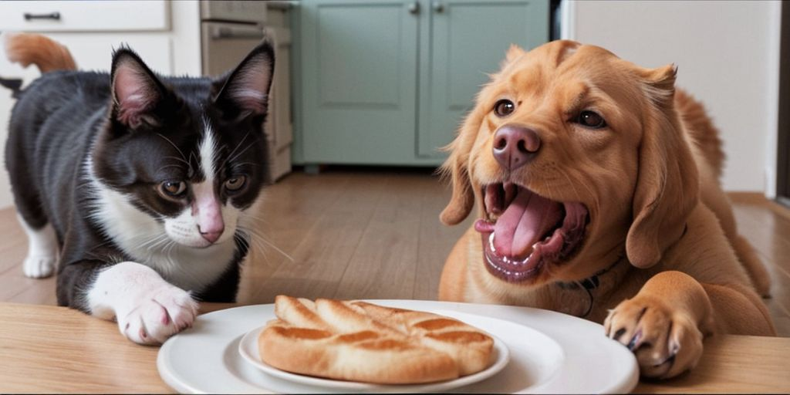

# Project Overview
This notebook made for the to DataTalksClub Machine Learning Zoomcamp Capstone Project 1 and is made by Lokman Efe and is about Dog or Cat Classification.

My Kaggle Profile: https://www.kaggle.com/lokmanefe

My GitHub Profile: https://github.com/lokicik

My LinkedIn Profile: https://www.linkedin.com/in/lokmanefe/

Feel free to reach out! ✌

You should download the dataset and change the variables' paths in the scripts to dataset's path but I suggest you to run the scripts in Kaggle notebooks and don't download the data, it would be easier since you wouldn't have to download the data, which is over 100 mb's. I developed the project on Kaggle too, so you don't have to change the dataset paths in the scripts, you just have to add the data to your notebook if you work on Kaggle.

# Project Presentation
I would like to introduce my most comprehensive project to date! I have completed the project "Dog or Cat Classification (CNN)" which I developed as the Capstone Project 1 of the Machine Learning Zoomcamp organized by DataTalksClub and presented by Alexey Grigorev. I had the opportunity to apply all the techniques I learned, and I gave my all to this project. I look forward to your feedback and hope for positive reviews!

## Description of the Problem
In the digital age, the sheer volume of images available on the internet poses a challenge 
for effective categorization. One prevalent domain is the classification of images 
into distinct categories, such as identifying whether an image contains a dog or a cat. 
This task is not only time-consuming but also prone to human error, making it a prime 
candidate for automation.

## Problem Solution
This project focuses on developing an image classification 
system capable of identifying images whether it's a dog or a cat.
Leveraging state-of-the-art deep learning techniques, a convolutional neural network (CNN) 
is trained to analyze and learn distinctive features present in dog and cat images.

## Dataset (https://www.kaggle.com/competitions/dogs-vs-cats/data)
The training archive contains 25,000 images of dogs and cats. 
Train an algorithm on these files and predict the labels for test1.zip (1 = dog, 0 = cat).

# Project Requirements (Evaluation Criteria)
* Problem description
* EDA
* Model training
* Exporting notebook to script
* Model deployment
* Reproducibility
* Dependency and environment management
* Containerization
* Cloud deployment

# Project Structure

* dog-or-cat-classification.ipynb: A notebook with project steps, EDA and hyperparameter optimization.
* train.py: A script for training the final model and saving it to a file.
* lambda_function.py: A script for loading the trained model, serving it via a web service (using Render) and making predictions.
* predict_cloud.py: A file for cloud predictions.
* predict_docker.py: A file for both Docker and local predictions.
* requirements.txt: A file listing project dependencies including library versions.
* Dockerfile: Docker container file, providing instructions for setting up the environment.
* dog_cat_classifier.tflite: The trained model.

# Dependency and environment management guide
 You can easily install dependencies from requirements.txt 

`pip install -r dependencies.txt`

# Containerization guide
`docker tag image_name YOUR_DOCKERHUB_NAME/image_name`

`docker push YOUR_DOCKERHUB_NAME/image_name`

# Deployment guide

### To run it locally (I used tflite, you can only deploy it locally on Linux):
* Run python predict.py on a terminal

* Open a new terminal and run python predict_docker.py

### To run it on docker:
Download and run Docker Desktop: https://www.docker.com/

* Open a terminal
* `docker build -t capstone1_project .`

* `docker run -it --rm -p 8080:8080 capstone1_project`

* Open a new terminal and run `python predict_docker.py`

### To run it on cloud:
* Push your image to docker hub like in the Containerization section

* Open https://render.com/ and create a web service

* Select "Deploy an existing image from a registry"

